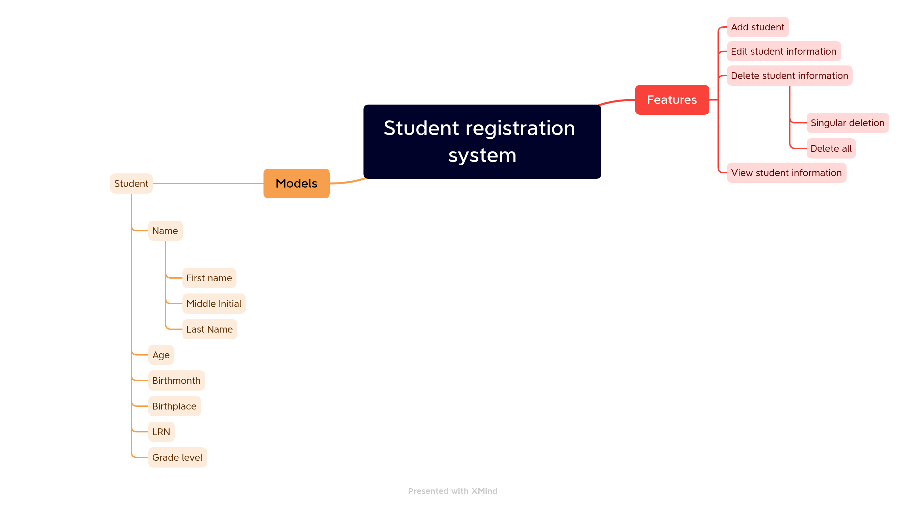

# Developer documentation

## Student registration system
It is a system that allows us to view, register, delete and update student's information.

### Requirements

#### Visual diagram of the requirements

- Add a student to the database

    **Note: Must be in a new window and contain the following forms:**

    - First name
    - Middle name
    - Last name
    - Age
    - Birthplace
    - LRN
    - Grade level

- Edit a student's information
- Delete a student's information
    - Singular
    - Delete all 
- View a student's information
- The information regarding to the students must be in table form showing the following informations.
    - First name
    - Middle name
    - Last name
    - Age
    - Birthmonth
    - Birthplace
    - LRN
    - Grade level
